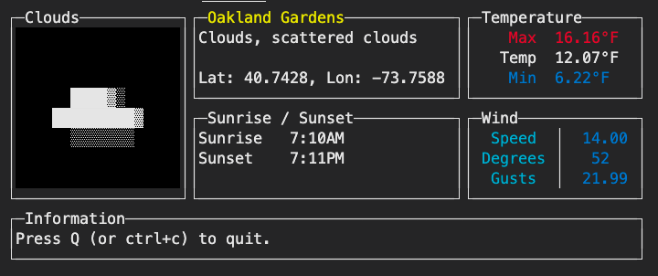

# Weather Console

This is an introductory project that I built using go. I wanted to build something that wouldn't take more than a couple of hours to get working.



## Running the project

To start the project copy the `.env.example` file and rename it to `.env`. Then go to OpenWeather API's website and signup to get an API key and store that in the `.env` file. Finally navigate to the directory and run

```
go run .
```

## Goals

- Get JSON data from an API
- Read `.env` file and get configuration options for the API
- Create a terminal application

## Discovery

I started by looking at projects like wtf and stripe-cli and reading their dependencies then going to the pages of packages I found interesting.

I found an awesome website for converting JSON data to a go struct that helped me map OpenWeather API data.
https://mholt.github.io/json-to-go/
